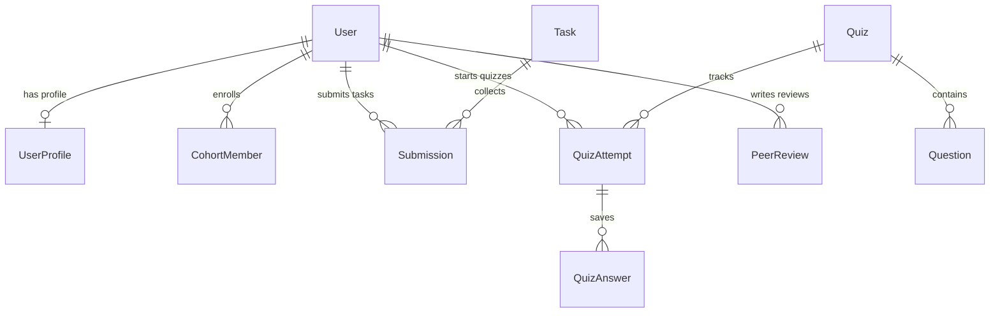

# Campus Launchpad — System Architecture Guide

This guide details the full-stack architecture, database models, business engine logic, security definitions, and deployment settings of the Campus Launchpad platform.

---

## 1. Relational Database Schema

The system operates a PostgreSQL database mapped via SQLAlchemy 2.0. All relational keys are secure, non-sequential UUIDs to prevent enumeration.



---

## 2. Gamified Engines & Calculations

### 2.1 XP Transaction Ledger
To prevent double-rewarding or farming, points are logged in a double-entry auditable ledger table (`xp_transactions`). 
- **Anti-Farming constraint**: A user can only receive XP for a specific source ID (such as a task submission) once.
- **Level Recalculation**: Whenever XP increases, levels are computed from configured benchmarks:
  - Level 1: 0 - 99 XP
  - Level 2: 100 - 249 XP
  - Level 3: 250 - 499 XP
  - Level 4: 500 - 999 XP
  - Level 5: 1000 - 1999 XP
  - Level 6: 2000+ XP

### 2.2 Streak/Consistency Checks
Users check in daily by signing in or submitting work. If they log back-to-back activity days:
- Streak count increments by 1.
- Streak bonuses are awarded (+15 XP for 3 days, +30 XP for 5 days).
- Inactivity flags are raised if days since last active exceeds 4 days.

### 2.3 Progress Engine
Syllabus progression metrics are calculated deterministically on the backend:
- **Tasks Score**: `(completed_mandatory_tasks_count / total_mandatory_tasks_count_in_week) * 100`
- **Assessment Score**: Student's highest score on mandatory quizzes.
- **Consistency Score**: `(days_active_in_week / 5.0) * 100`
- **Overall Progress**: `Tasks * 40% + Quizzes * 30% + Peer * 10% + Projects * 10% + Consistency * 10%`

---

## 3. Secure Auth & RBAC Middleware

- **Authentication**: JWT access tokens (15-minute expiration) with encrypted refresh tokens (7-day rotation).
- **2FA TOTP**: Administrators must complete a 6-digit Google Authenticator OTP verification before accessing backend services.
- **Role-Based Access Control**:
  - `student`: Standard access (roadmap viewing, submitting code, peer reciprocal confirmations).
  - `mentor`: Elevated access (grades student task submissions, reviews project team milestones).
  - `admin`: Full override access (adjusts student XP, manages week locks, triggers auto-grouping).

---

## 4. Developer Deployment Guide

1. Copy `.env.example` to `.env` and fill out database variables.
2. Build and start containers:
   ```bash
   docker compose up --build -d
   ```
3. Run migrations inside backend container:
   ```bash
   docker compose exec backend alembic upgrade head
   ```
4. Run database seeder:
   ```bash
   docker compose exec backend python app/database/seed.py
   ```
5. Execute the test suite:
   ```bash
   docker compose exec backend pytest
   ```
