# Campus Launchpad — Full-Stack Educational & Student Development Platform

This implementation plan details the end-to-end architecture, database schema, API specification, business logic engines, security controls, and deployment strategy for building the **Campus Launchpad** platform. It has been designed as a modular monolith to serve the initial 200–250 students in a stable, maintainable, and verifiable manner.

---

## User Review Required

> [!IMPORTANT]
> The platform is built around **strict rules regarding separation of concerns**:
> 1. **XP & Progress** are separate systems. Progress represents module, task, and project completion, whereas XP is a score of total gamified achievements.
> 2. **AI Logic** only acts as an analytics layer on top of validated metric outputs. Under no circumstances can AI modify the official database metrics (XP, scores, completions, etc.).
> 3. **Deterministic at-risk logic** is run prior to any AI modeling to flag students based on inactivity, missed milestones, and drop-off rates.
> 4. **A sandbox execution manager** is proposed for coding challenges to ensure student code submissions are run isolated from the main FastAPI server and database.
> 5. **Multi-device session revocation** and **TOTP-based 2FA for administrators** will be implemented as core security layers.

> [!WARNING]
> Production-grade file uploads will be abstracted through a Storage Provider interface, defaulting to local disk storage for development and S3-compatible object storage for production.

---

## Open Questions

> [!IMPORTANT]
> Please review and clarify the following:
> 1. **Sandbox Execution Engine**: Since we will run tests inside Docker, should the code runner execute locally inside a subprocess sandbox (e.g., Python `multiprocessing` or isolated Docker containers) or simply run in a mock sandboxed runner class for initial local development? (We recommend a subprocess runner with system-level constraints like resource limits).
> 2. **SMTP and Email**: For password recovery, should we include a mockup email sender that logs emails to a local file or console during development, or configure a real SMTP service? (We recommend console logging with standard environment hooks).
> 3. **GitHub OAuth**: Should the GitHub account connection be completed via a mock integration client that simulates sync activity or should we implement the real GitHub OAuth flow? (We recommend building a dual-mode integration: a simulated service for testing and a real OAuth client that runs when client secrets are provided).

---

## Proposed Changes

We will construct the project as a monorepo containing `backend`, `frontend`, `docs`, and deployment files at the root level.

```text
campus-launchpad/
│
├── frontend/             # Next.js Application
├── backend/              # FastAPI Application
├── docs/                 # Platform Documentation
├── scripts/              # Seed & Setup Scripts
├── tests/                # System Integration Tests
├── docker-compose.yml    # Development & Orchestration
├── .env.example          # Environment blueprint
└── README.md             # Project Root Readme
```

---

### 1. Database Component & ER Schema

We will configure a PostgreSQL database using **SQLAlchemy 2.0 (async)** and **Alembic** migrations. The schema includes the following tables:

```mermaid
erDiagram
    users ||--o| student_profiles : "has"
    users ||--o{ user_roles : "has"
    users ||--o{ cohort_members : "belongs"
    cohorts ||--o{ cohort_members : "contains"
    cohorts ||--o{ peer_groups : "contains"
    peer_groups ||--o{ peer_group_members : "contains"
    users ||--o{ peer_group_members : "belongs"
    
    weeks ||--o{ modules : "has"
    modules ||--o{ content : "has"
    content ||--o{ content_progress : "tracked"
    users ||--o{ content_progress : "tracks"
    
    weeks ||--o{ tasks : "contains"
    modules ||--o{ tasks : "contains"
    tasks ||--o{ submissions : "has"
    users ||--o{ submissions : "submits"
    submissions ||--o{ submission_versions : "versions"
    submissions ||--o{ submission_files : "files"
    submissions ||--o{ submission_reviews : "reviews"
    
    modules ||--o{ quizzes : "has"
    quizzes ||--o{ questions : "contains"
    quizzes ||--o{ quiz_attempts : "attempts"
    users ||--o{ quiz_attempts : "attempts"
    quiz_attempts ||--o{ quiz_answers : "answers"
    questions ||--o{ quiz_answers : "answers"
    
    peer_groups ||--o{ peer_activities : "hosts"
    peer_activities ||--o{ peer_activity_submissions : "submissions"
    peer_activity_submissions ||--o{ peer_reviews : "reviews"
    
    users ||--o{ domain_explorations : "explores"
    domains ||--o{ domain_explorations : "contains"
    
    projects ||--o{ project_teams : "teams"
    project_teams ||--o{ project_members : "members"
    users ||--o{ project_members : "belongs"
    projects ||--o{ project_milestones : "milestones"
    project_teams ||--o{ project_submissions : "submits"
    project_submissions ||--o{ project_reviews : "reviews"
    
    users ||--o{ xp_transactions : "earns"
    users ||--o{ progress_metrics : "calculates"
    users ||--o{ ranking_snapshots : "ranks"
    users ||--o{ consistency_records : "streaks"
    users ||--o{ activity_events : "creates"
    users ||--o{ notifications : "receives"
    users ||--o{ ai_insights : "receives"
    users ||--o{ risk_flags : "flags"
    users ||--o{ audit_logs : "audited"
```



#### Major Entities Description:
- **`users`**: Master user accounts. Stores credentials, `totp_secret` (for admins), authentication state, and registration details.
- **`student_profiles`**: Personal profile elements (GitHub details, department, year, tech interests, skills).
- **`weeks`**: Curriculum container mapping scheduled start/end dates, lock dates, override constraints, and mandatory status.
- **`tasks`**: Direct deliverables mapping deadlines, categories (GitHub, Coding, Peer, Challenge), rewards, and types.
- **`submissions` & `submission_versions`**: Submissions are version-controlled. Re-submissions create a new entry in `submission_versions` rather than overwriting history.
- **`xp_transactions`**: Auditable double-entry record of all XP awards. XP cannot be arbitrarily updated; it must be backed by a row in this table.
- **`progress_metrics`**: Aggregated progress percentages across Foundation, Learning, Assessment, Peer, and Project.
- **`ranking_snapshots`**: Weekly calculations explaining exact score components, weights, absolute rank, and rank movement.
- **`risk_flags`**: Deterministic risk tracker monitoring inactivity, trailing grades, and missing tasks.

---

### 2. Backend Component (FastAPI & Engines)

The backend code structure will follow standard separation of concerns:
```text
backend/app/
├── api/
│   └── v1/
│       ├── auth.py          # JWT registration, logins, 2FA setup, recovery
│       ├── curriculum.py    # Weeks, modules, progression, unlocks
│       ├── tasks.py         # Submissions, versions, file uploads
│       ├── quizzes.py       # Quizzes, attempts, grading
│       ├── metrics.py       # XP, Leaderboards, Progress metrics
│       ├── peers.py         # Peer groups, activities, review verifications
│       ├── projects.py      # Teams, anonymous codes, milestones, evaluations
│       ├── github.py        # Repository hookups, webhook receivers
│       └── admin.py         # Overrides, user management, audit views, exports
├── core/
│   ├── config.py            # Pydantic Settings (.env validator)
│   ├── security.py          # Bcrypt hashing, JWT tokens (Refresh/Access rotation)
│   ├── exceptions.py        # Centralized HTTP & Application exceptions
│   └── storage.py           # Upload helper interface (disk / S3 abstract)
├── database/
│   ├── session.py           # Async engine & session hooks
│   └── base_model.py        # Base SQLAlchemy classes
├── models/                  # Declarative SQLAlchemy models
├── schemas/                 # Pydantic Request/Response models
├── services/                # Business logic layers (AuthService, ProjectService)
├── engines/                 # Pure scoring & status compilers
│   ├── xp.py                # Transaction writer, anti-farming validations
│   ├── progress.py          # Deterministic progression formula compiler
│   ├── ranking.py           # Score components + weighting snapshot creator
│   ├── consistency.py       # Streak calculators
│   └── risk.py              # At-risk scoring rule engine
└── ai/
    ├── pipeline.py          # Background metric aggregator
    └── client.py            # LLM prompt builder for insights
```

#### Core Business Logic Engine Details:

1. **XP Engine (`engines/xp.py`)**:
   - Manages points logic (e.g., Mandatory: 100 XP, Optional Challenge: 50–150 XP, Peer Activity: 50 XP, Quiz: 20–50 XP, Milestone: 100–300 XP).
   - Validates anti-farming rules: checks if an XP transaction for `(student_id, source_type, source_id)` already exists before writing to prevent duplicate rewards. Limits repeat daily XP caps.

2. **Progress Engine (`engines/progress.py`)**:
   - Calculates progress deterministically:
     $$\text{Overall Progress} = w_f \cdot \text{Foundation} + w_l \cdot \text{Learning} + w_a \cdot \text{Assessment} + w_p \cdot \text{Peer} + w_r \cdot \text{Project}$$
     - Weeks 1–4 focus on Foundation & Learning.
     - Weeks 5–6 focus on Domain Exploration.
     - Weeks 7–12 focus on Project and Collaboration.
   - Formula parameters are dynamic and configurable at the database level.

3. **Ranking Engine (`engines/ranking.py`)**:
   - Computes weighted overall scores:
     - Assessment Performance (30%)
     - Project Performance (30%)
     - Task Completion (20%)
     - Consistency / Streaks (10%)
     - Peer Contribution (10%)
   - Generates weeklysnapshots, calculates rank offset ($+x$/$-y$ positions compared to the prior week), and provides component breakdowns to make changes auditably clear to the student.

4. **Consistency/Streak Engine (`engines/consistency.py`)**:
   - Tracks consecutive days/weeks of platform heartbeats, submissions, and quiz completion.
   - Streak rewards (e.g., 3-Day: +15 XP, 5-Day: +30 XP, Weekly: +50 XP).
   - Grace periods: Allow a monthly "streak freeze" if requested or automatically computed under soft guidelines.

5. **Sandbox Execution Queue (`core/sandbox.py`)**:
   - Coding challenges submit solutions to an asynchronous Celery/Redis worker queue.
   - The sandbox runs student code inside Python's isolated `subprocess` configuration with restricted file access, CPU execution quotas (max 2 seconds), memory caps (max 64MB), and network blockages.
   - Results are verified against seeded unit tests, returning stdout/stderr and test assertions to the submission evaluator.

---

### 3. Frontend Component (Next.js & UI/UX)

The frontend will use Next.js App Router, written in TypeScript with Tailwind CSS. It is split into interactive features:

```text
frontend/src/
├── app/                      # Next.js App Router paths (login, dashboard, roadmap, admin, etc.)
├── components/               # Shareable primitives (Button, Card, Modal, Input, Layouts)
├── features/                 # Modular page logic & sub-elements
│   ├── auth/                 # Sign-in forms, TOTP 2FA input, profile creation
│   ├── dashboard/            # Dynamic progress charts, XP trackers, streak indicators
│   ├── curriculum/          # 12-week roadmap grid, locked/unlocked visual pathways
│   ├── tasks/                # Submission workflows, resubmission sliders
│   ├── quizzes/              # Interactive timers, quiz attempts, answer savers
│   ├── projects/             # Team creation, milestone progress meters
│   ├── leaderboard/          # Paginated score table with rank movement indicators
│   └── admin/                # Cohort management, submissions reviews, CSV exports
├── services/                 # Axios-based API client wrappers (instance with automatic token rotation)
├── hooks/                    # Reusable React hooks (useAuth, useLocalStorage, useInterval)
├── types/                    # Domain models & TypeScript interfaces
└── utils/                    # Formatting helpers
```

#### Notable UI Flows & Components:
- **Responsive 12-Week Roadmap**: A visually appealing grid layout showing the student's journey. Locked weeks render with lock indicators, showing a detailed lock description (e.g., "Unlocks on [Date]. Complete Week [X] first.") on click.
- **Auto-Saving Quiz Attempt Panel**: Prevents loss of answers during refreshing by syncing responses locally via `localStorage` and periodically syncing with the FastAPI `/quizzes/attempts/save` endpoint in the background.
- **Admin Audit Trail & Override Controls**: Admins can adjust student XP, unlock weeks manually, and bypass constraints. Every action triggers an auditable log entry containing the actor, action, timestamp, and explanation.

---

### 4. Seed Strategy & Initial Data (`scripts/seed.py`)

A database seeding script will generate a complete, working curriculum matching the Noxus documents:
1. **Core Accounts**:
   - Admin: `admin@campuslaunchpad.com` / Password: `AdminDevelopment123!` (triggers simulated TOTP)
   - Mentor: `mentor@campuslaunchpad.com` / Password: `MentorDevelopment123!`
   - Sample Students: 5 student profiles linked to a cohort.
2. **12-Week Curriculum Curriculum Mapping**:
   - **Week 1**: Foundation & Onboarding (Orientation, Digital Presence, Git Basics, Domain Exploration).
   - **Week 2**: Git, GitHub & Developer Workflow (Beginner Coding Practice, Platform-based Easy Problems, README guidelines).
   - **Week 3**: Problem Solving & Domain Exploration (APIs, Client-server, Domain paths).
   - **Week 4**: Collaboration & Mini Project Sprint (Team formation, GitHub for teams, MVP development).
   - **Weeks 5–6**: Domain Specialization & Advanced Collaboration (Web, AI/ML, IoT, Cyber, CAD tracks).
   - **Week 7**: Major Project Ideation & Planning (Problem Discovery, Design, Team formation).
   - **Week 8**: Major Project Sprint 1 (MVP Setup, Core development).
   - **Week 9**: Major Project Sprint 2 & Deployment (Integration, testing, Bug bash, deployment).
   - **Week 10**: Portfolio & Final Showcase (GitHub cleanup, resumes, LinkedIn, Noxus showcase).
   - **Week 11**: Open Source & Community Contribution (Fork, branch, pull request to other repos).
   - **Week 12**: Hackathon & Opportunity Readiness (Mini hackathon, Skill gaps, transition selection).

---

### 5. Infrastructure & Security Strategy

#### Docker Configuration:
We will deploy the environment using `docker-compose.yml`:
- **`db`**: PostgreSQL 16 image.
- **`cache`**: Redis 7 image for caching, rate limiting, and background queue handling.
- **`backend`**: Python FastAPI app container, executing Uvicorn with watch flags during development.
- **`frontend`**: Next.js Node container, compiling/running React pages.

#### Security Controls:
- **Authentication**: JWT-based access token lifecycle (15 minutes) + Refresh token rotation (stored in HttpOnly, secure, Lax cookies).
- **IDOR Protection**: Every request checks row ownership (e.g., `submission.student_id == current_user.id` or `current_user.role in [ADMIN, MENTOR]`).
- **File Upload Protection**: Enforces file extensions, size limits (< 10MB), checks magic headers (MIME check), and maps file names to secure UUIDs on disk.
- **TOTP 2FA**: Mandatory setup flow for admins using Google Authenticator codes.

---

## Verification Plan

### Automated Tests
We will run tests via pytest inside the backend container:
- **Unit & Business Logic Tests**:
  - `pytest backend/tests/unit/test_xp_engine.py`: Verifies XP transaction checks, points matching, and anti-farming prevents duplicate records.
  - `pytest backend/tests/unit/test_progress_engine.py`: Validates deterministic formulas against changing completion states.
  - `pytest backend/tests/unit/test_ranking_engine.py`: Verifies rank score components, snapshots, and offsets.
- **Integration & Security Tests**:
  - `pytest backend/tests/integration/test_auth.py`: Validates password registration, JWT expiration, refresh rotation, and TOTP verification.
  - `pytest backend/tests/integration/test_authorization.py`: Checks IDOR attempts, ensures students cannot read other submissions or fetch admin endpoints.
  - `pytest backend/tests/integration/test_quiz.py`: Tests automated MCQ quiz grading, attempt limits, and answer tracking.
  - `pytest backend/tests/integration/test_curriculum.py`: Tests progression rules, checking if locked weeks reject queries.

### Manual Verification
1. **Curriculum Roadmap & Unlock Flow**:
   - Log in as student, attempt to access Week 4 modules without completing Week 3, verify error code and UI message.
2. **Resubmission History**:
   - Submit a task, leave review feedback as admin requesting revision, resubmit as student, check that both version 1 and version 2 are accessible in the history component.
3. **Data Export CSV**:
   - Trigger the CSV export from the Admin dashboard, check formatting, and verify that the exported data matches the database state.
